# 👋 Hi, I'm Lazhenyi!

## 🚀 About Me
- 🎓 **Undergraduate student** currently pursuing my bachelor's degree of CS
- 🔭 I specialize in **high-concurrency, high-available systems** and **AI Agent** development
- 🌱 Exploring modern technology stacks and cutting-edge solutions
- 💬 Ask me about Rust, Go, TypeScript, or system architecture
- 📫 How to reach me: 
  - 
  (slow)
  -  (fast)
- ⚡ Fun fact: I love building scalable and intelligent systems!

## 💻 Tech Stack

### Languages

### Frameworks & Libraries

### DevOps & Infrastructure

### Tools & IDEs

## 📊 GitHub Stats

  
  

## 🎯 Expertise Areas
- **High Concurrency Systems** - Building scalable applications that handle massive traffic
- **High Availability Architecture** - Designing fault-tolerant and resilient systems  
- **AI Agent Development** - Creating intelligent agents with modern AI frameworks
- **Modern Full-Stack Development** - From backend services to frontend interfaces
- **Cloud Native Technologies** - Containerization, orchestration, and microservices

## 🏗️ Current Focus
- Building high-concurrency systems with **Rust** and **Go**
- Developing AI Agents with modern frameworks
- Creating scalable microservices with **Kubernetes** and **Docker**
- Full-stack applications using **React/Vue** + **Node.js/Go**

## 🎯 My Goals
- ✅ Master distributed systems and cloud-native architectures
- 🎯 Contribute to open source projects in the Rust and Go ecosystems
- 🌟 Build innovative AI-powered applications
- 📚 Share knowledge and mentor other developers
- 🚀 Launch production-grade high-concurrency systems

---

  
  

  Made with ❤️ and Markdown

